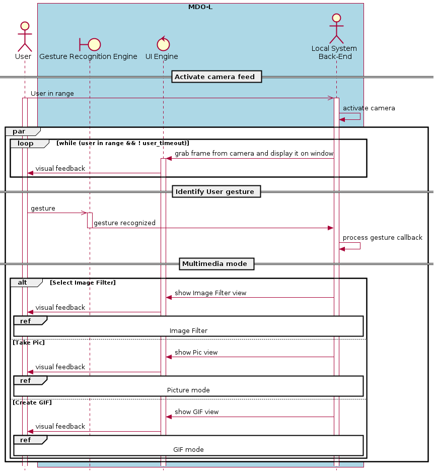

- [Preamble](#orgbb42a81)
  - [Requirements](#org31b21c4)
  - [Features <code>[2/4]</code>:](#orga7611c9)
- [Compilation](#org1e55cb7)
- [Specific channels for comm](#org561c071)
  - [System behavior](#org65f14e5)
  - [Use cases overview](#org9bb9150)
  - [Sequence diagrams](#org999f227)
  - [State machine diagram](#org9604f08)

# Preamble

This is a small C++ broadcast chat.

## Requirements

1.  Each Client MUST be connected to the Server via TCP/IP.
2.  The Server MAY host more than 3 clients.
3.  Each Client connected to the Server MUST be able to send to the Server a character string passed by argument via command line arguments. (Ex: ./send.out "Hi Everyone!").
4.  The Server MUST forward the received messages to all connected Clients.
5.  The Server SHOULD identify the client that has sent the message. (Ex. "Bento said: Hi Everyone!")
6.  Every 5 seconds the Server MUST check if each client is still ONLINE or AFK. (This message exchange SHOULD NOT show up on the chat terminal, is an internal feature).
7.  The Server MAY have a special command to check the client status.
8.  The Client MAY switch his status from ONLINE to AFK if has not sent any new message for more than a minute.
9.  The Client Message Receiver Service MAY run in the background.
10. The Server App, the Client Message Receiver Service, the Client Message Sender Service SHOULD take leverage of POSIX Threads, IPC, and DAEMON for their development.

**Terminology and Definitions**

1.  SHALL indicates an absolute requirement, as does MUST.
2.  SHALL NOT indicates an absolute prohibition, as does MUST NOT.
3.  SHOULD and SHOULD NOT indicate recommendations.
4.  MAY indicates an option

## Features <code>[2/4]</code>:

-   [X] Message broadcast between server and clients
-   [X] Check online status
-   [ ] Device drivers for LED
-   [ ] Specific channels for communication with particular clients

# Compilation

To compile run `make`.

# Specific channels for comm

Create specific channels for communication with particular "clients":

-   System behavior (short text)
-   System Overview
-   Sequence diagram
-   State diagrams

## System behavior

Each client can request the server to create a topic which is available to all clients that subscribe to that topic.

-   If a client subscribe to a topic, it can send/receive messages being published to that topic. Additionally, it gets notified of every update on the topic.
-   Only the client that creates the topic, can remove it.
-   The clients that don't want to receive updates on a particular topic must unsubscribe from it.

## Use cases overview

-   **Create topic**: a client requests the server to create a topic. The server will try to create the topic and will return the topic creation status.
-   **List topics**: a client request the server to list the available topics to chat. The server returns the available topics or an empty list.
-   **Subscribe topic**: a client request the server to subscribe to an available topic. The server returns the status.
-   **Unsubscribe topic**: a client request the server to unsubscribe from a topic that it had previously subscribed to. The server returns the status.
-   **Remove topic**: only the client that created the topic can request its removal from the server. If the server accepts the request, it removes the topic from the list.

## Sequence diagrams

**Create topic**

## State machine diagram
